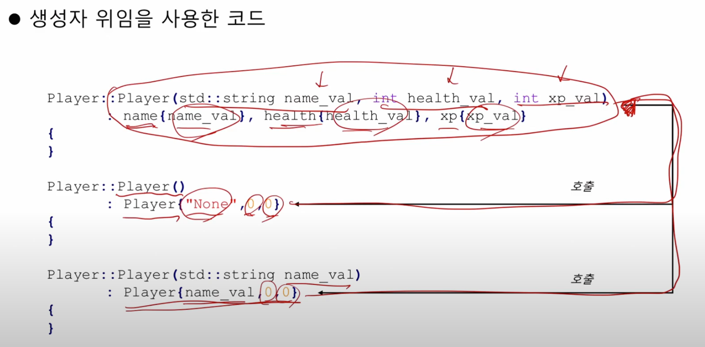

# C++
C++ Progrmaing 문법 정리

---

> 9_ 객체지향

## 절차적 프로그래밍 VS 객체 지향 프로그래밍 

| 절차적 프로그래밍

- 절차적 프로그래밍 => 함수 중심 프로그래밍
- 작업의 구현 = 함수, 합수의 집합 = 프로그램
- 데이터와 작업이 분리되어 있는 개념 (중요)
- 데이터는 단순히 함수에 전달되는 값
- 데이터와 함수가 분리되어 있어, 데이터 무결성 유지 어려움, 코드 재사용성 낮음, 데이터가 변하면 함수의 수정이 필요함.
- 이 단점을 극복하려면 데이터가 변해도 함수가 영향을 받지 않도록 해야함.
- 이를 위해 데이터와 함수를 하나로 묶는 개념이 필요함 => 객체

| 객체 지향 프로그래밍 

- 객체 지향 프로그래밍 => 데이터 중심 프로그래밍 ex> Java, C++, c#, Python
- 작업의 구현 = 함수, 합수의 집합 = 프로그램
- 데이터와 작업이 결합된 개념 (중요)
- 데이터는 객체의 속성(멤버 변수)으로, 작업은 객체의 동작(멤버 함수)으로 표현

| 특징 

 - 캡슐화     -> 데이터와 함수를 하나로 묶음 -> 데이터 무결성 유지, 코드 재사용성 향상
 - 정보 은닉  -> 객체의 내부 구현을 숨기고, 외부에는 필요한 인터페이스만 제공 -> 복잡성 감소, 유지보수 용이
 - 상속      -> 기존 객체를 기반으로 새로운 객체를 생성 -> 코드 재사용성 향상, 계층적 구조 표현
 - 다형성    -> 동일한 인터페이스를 통해 다양한 객체를 다룰 수 있음 -> 유연성 향상, 코드 확장 용이

 | 클래스

 - 객체(object)가 생성되기 위한 틀 => 객체가 가져야 할 데이터와 기능을 정의
 - 멤버 변수를 가짐 (데이터)
 - 멤버 함수를 가짐 (함수, 동작)
 - 데이터와 함수를 은닉 가능
 - 인터페이스를 공개 가능 

 | 객체

 - 클래스로부터 생성된 객체
 - 객체는 개별적으로 관리되며, 원하는만큼 생성 가능함
 - 객체를 통해 클래스에 정의된 멤버 함수를 호출 가능 

 | 클래스 멤버의 접근

 - 멤버 변수/함수에 접근하기 위해서는 객체가 필요 (static 멤버는 예외)
 - public (어디서든 접근 가능)
 - private => 클래스의 멤버 (friend 클래스에서만 접근 가능)

 | 멤버 함수의 구현

 - 멤버 변수에 접근이 가능하기 때문에 인자로 전달할 데이터가 적어짐

 | 구조체와 클래스 차이

 - 구조체는 default가 public 
 - 클래스는 default가 private

--- 

 | 생성자 (constructor)

 - 특수한 멤버 함수
 - 객체가 생성될 때 자동으로 호출됨
 - 클래스와 동일한 이름을 갖는 멤버 함수
 - 반환형은 존재하지 않음
 - 오버로딩 가능
 - 생성자를 안만들면 자동으로 파라메터없는 생성자가 나오지만, 이미 생성자(파라매터가 있든 없든)를 만든다면 자동으로 안만듬 

 | 소멸자 ()
 
 - 특수한 멤버 함수
 - 객체가 소멸할 때 자동으로 호출됨
 - 클래스와 동일한 이름 앞에 "~"을 갖는 멤버 함수
 - 반환형 및 파라메터는 존재하지 않음
 - 오버로딩 불가능 

 | 생성자 초기화 리스트 (중요)

 - 생성자 초기화 리스트를 사용할 경우 생성과 동시에 값이 지정됨.
 ex>
 ```c

      player::player()
          : name{"none"}, health{0}, xp{0}

 ```
 | 생성자 위임 (중요)

 - 다양한 생성자 오버로딩에 유사한 코드가 반복적으로 사용
 - 오류의 가능성이 높아짐 
 - 다른 생성자를 멤버 초기화 리스트 위치에서 호출함 (생성자 또한 함수이니까)

 